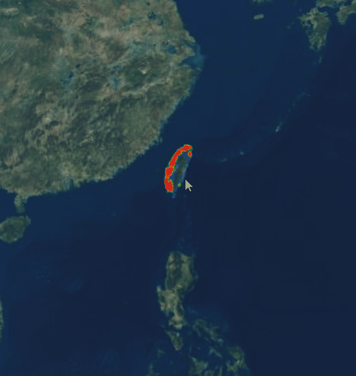

# cesium-heat

heatmap for cesium | cesium的热力图



## usage

install

```
npm i cesiumjs-heat --save
```

code

```
import * as Cesium from 'cesium'
import data from './data/last-all-airbox'
import getCesiumHeat from 'cesiumjs-heat'

// handle Cesium import on your own | 剔除了Cesium的依赖，因为在npm依赖了也不能直接使用，因为amd标准需要配置webpac 
const CesiumHeat = getCesiumHeat(Cesium)
const viewer = new Cesium.Viewer('container')

// auto add after construct | 构造后自动添加到cesium图层
let heat = new CesiumHeat(
  viewer, 
  // data list, each has x, y, and value | 数据数组，每个包含 x,y,value字段
  data.feeds.map(({ gps_lon, gps_lat, s_d0 }) => {
    return {
      x: gps_lon,
      y: gps_lat,
      value: s_d0,
    }
  }),
  // bbox for heatmap | 只在范围内显示热力图拉近会清晰些，默认整个地球但拉近后巨模糊
  [120.106188593, 21.9705713974, 121.951243931, 25.2954588893]
)

// destory | 销毁
setTimeout(()=>heat.destory(),10*1000)

```

## params

```
let heat = new CesiumHeat(
  // cesium viewer
  viewer, 

  // data list, each has x, y, and value | 数据数组，每个包含 x,y,value字段
  {
    autoMaxMin: true,       // 自动计算最大值和最小值
    min: 0,                 // 指定最小值，autoMaxMin时无效，非autoMaxMin时必填
    max: 100,               // 指定最大值，autoMaxMin时无效，非autoMaxMin时必填
    data: [                 // 数据数组，默认空数组
      {
        x: 120.106188593,   // 经度坐标（-180~180）
        y: 21.9705713974,   // 纬度坐标 （-90~90）
        value: 10,          // 值
      }
    ]
  },

  // bbox for heatmap | 只在范围内显示热力图拉近会清晰些，不填默认整个地球但拉近后巨模糊
  [120.106188593, 21.9705713974, 121.951243931, 25.2954588893],

  // heatmap.js construction | heatmap.js的构造配置，不填默认如下，参考 https://www.patrick-wied.at/static/heatmapjs/docs.html
  {},

  // auto radius change with height | 自动按高度控制热点的辐射，默认值如下
  {
    enabled: true,  // 是否开启，关闭的话不会自动更新
    min: 6375000,   // 最低高度，对应高度的辐射为minRadius
    max: 10000000,  // 最大高度，对应高度的辐射为maxRadius
    maxRadius: 20 * 2,
    minRadius: 5 * 2,
  },

  // auto resize canvas | 自动按bbox形状控制canvas形状，默认值如下，canvas面积越大越清晰，也越卡
  {  
    autoResize: true,   // 是否自动调整canvas
    totalArea: 360 * 2 * 720 * 2,  // 总面积，如果自动，必填，如果不自动，无效
    width: 720 * 2, // canvas宽度，如果不自动，必填，如果自动，无效
    height: 360 * 2, // canvas高度，如果不自动，必填，如果自动，无效
  }
)

// 动态增加数据（多个）
heat.addData([           // 数据数组
  {
    x: 120.106188593,   // 经度坐标（-180~180）
    y: 21.9705713974,   // 纬度坐标 （-90~90）
    value: 10,          // 值
  }
])

// 动态增加数据（单个）
heat.addData({
  x: 120.106188593,   // 经度坐标（-180~180）
  y: 21.9705713974,   // 纬度坐标 （-90~90）
  value: 10,          // 值
})

```